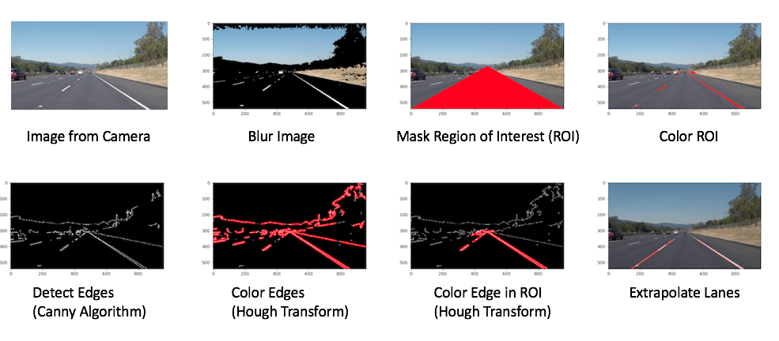
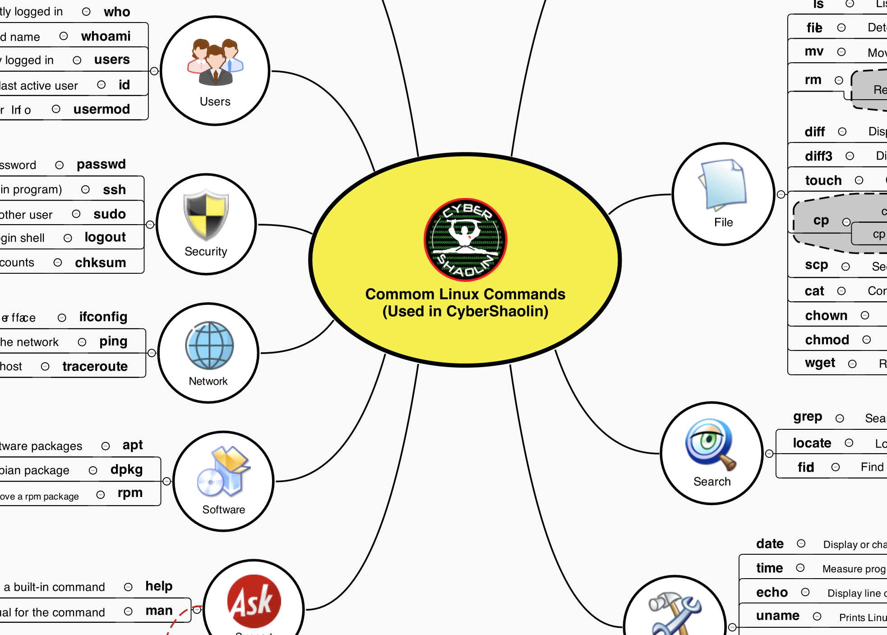

# Reuben Paul's Portfolio of Projects (AI, Cybersecurity, Programming)

AI, cybersecurity, and programming projects that **I build to learn** and **teach others**!

---
## Who Am I? 🤘

Hello, I am Reuben Paul! I am a **McCombs School of Business** student.
I love **AI, cybersecurity, and Programming** and have been passionate about technology 

---
## AI Projects 🤖

### 1. **AI Notifeye (Driver Safety Camera Device)** 🧿🧿
  I coded a camera software using AI Facemesh technology that will track the human eye and founded Notifeye
  as part of my Business Incubator class in my junior year in High School. Notifeye won the first place in 
  the Nationals Incubatoredu competition and was incorporated into a company. 
  To get an idea of how Notifeye works, please see the following video.
  
  [](https://www.youtube.com/watch?v=2hg6Wzpo1hM)
  
  - **Purpose** Save lives by notifying the driver if they are drowsy or distracted
  - **Application**: Driver Safety
  - **Technologies**: AI Facemesh, OpenCV

### 2. **AI Face Tracking Drone (For FedEx)** 🎭
  I coded a face tracking software to control a drone 
  To get an idea of how Notifeye works, please see the following video.
  
  [](https://www.youtube.com/watch?v=gDkTH1WnpPI)
  
  - **Purpose** Track the human face and follow it
  - **Application**: Delivery of Fedex packages via drones to the correct person
  - **Technologies**: AI Facemesh, OpenCV

### 3. **AI Video Transcriber** 📽️
  In this project, I use OpenAI's Whisper API to transcribe videos to text.
  - **Purpose** Use OpenAI's Speech to Text Whisper API to transcribe text
  - **Application**: Useful to transcribe professor videos to text so you can take the transcript and summarize it with a fast read
  - **Technologies**: OpenAI Whisper, FFMPEG, Jupyter notebook
  ```
  Detecting language using up to the first 30 seconds. Use `--language` to specify the language
  Detected language: English
  [00:00.000 --> 00:24.580]  I'm at the foot of the ladder. The LAM footbeds are only depressed in the surface about one or two inches, although the surface appears to be very, very fine-grained as you get close to it. It's almost like a powder. Ground mass is very fine.
  [00:30.000 --> 00:38.240]  Yeah, I'm going to step off the LAM now.
  [00:47.520 --> 00:55.280]  That's one small step for man, one giant leap for mankind.
  [01:00.000 --> 01:01.520]  Yeah, I'm going to step off the LAM.
  ```

### 4. **AI Phishing URL Detector** lure 🎣


In this project, I use Machine Learning to train a model using malicious URL data and then use the model to predict if a link that is sent is a phishing or malicious link or not. 
  
  - **Purpose** Detect hacker attempts to phish (steal) information
  - **Application**: Use to protect users by against phishing threats
  - **Technologies**: sci-kit-learn, numpy, Pandas, Matplotlib, Jupyter notebook
  
  Open juptyer notebook to see how the code works
  Remember the words of the wise - Gandalf the Wise!

### 5. **AI Self-Driving Cars** 🚗 


  In this project, I use Machine Learning and OpenCV to have the car camera detect lanes and extrapolate the lanes for self-driving
  - **Purpose** Autonomous (self-driving) 
  - **Application**: Humanless transportation
  - **Technologies**: sci-kit-learn, numpy, Pandas, Matplotlib, Jupyter notebook

### 6. **AI Drone Path Planning (Flyer Cars)** 🛸🧭

This project was coded to demonstrate how a Drone can track a detect buildings and navigate around obstacles using Motion Path Planning.

A clip showing the  Motion Planning working code is shown below.


  - **Purpose** Flying Cars
  - **Application**: Airborne transportation
  - **Technologies**: sci-kit-learn, numpy, Pandas, Matplotlib, Jupyter notebook

## Cybersecurity Projects 🛡️

### 7. **Introduction to Cybersecurity** 🚨


This series of .MD files were created as a lesson to teach the Introduction to Cybersecurity through my non-profit organization, CyberShaolin.

  - **Purpose** Teach the Introduction of Cybersecurity 
  - **Application**: Safe and Secure Online World
  - **Technologies**: whois, whoami

```
 {
    "title": "Intro To Cyber",
    "description": "Learn the very basics about cybersecurity.",
    "courses": [
      {
        "lesson_id": "whoami",
        "title": "Whoami",
        "description": "Basic Command to introduce you to terminal and cybersecurity."
      },
      {
        "lesson_id": "whois",
        "title": "Whois",
        "description": "Basic Reconnaissance Command to learn about registered users of an internet resource."
      }
    ]
  }
```
NOTE: These lesson files are rendered within the CyberSecurity portal as a lesson plan. 

### 8. **Hacking Secrets** ㊙️🕵️

This series of .MD files were created as a lesson to teach how hackers hack secrets and what one can do to protect against such threats. These lessons are delivered through my non-profit organization, CyberShaolin.

  - **Purpose** Learn how hackers hack secrets
  - **Application**: Safe and Secure Online World
  - **Technologies**: John-The-Ripper Password Cracking, Rainbow Table Cracking, Steganography (Hiding data within images and media) 

```
{
  "pathwayTitle": "Hacking Secrets",
  "title": "Hacking Secrets - Hackercise",
  "description": "Common hacking secrets techniques.",
  "difficulty": "Beginner",
  "time": "30 minutes",
  "details": {
    "steps": [
      {
        "title": "Start",
        "text": "hacking-secrets-start.md"
      },
      {
        "title": "Scenario - CIA Agent Bourne Hacking Secrets Mission",
        "text": "hacking-secrets-1-scenario.md",
        "answer": "hacking-secrets-2-solution.md"
      },
      {
        "title": "End",
        "text": "hacking-secrets-end.md"
      }
    ],
    "intro": {
      "text": "intro.md",
      "credits": "&copy; CyberShaolin. All rights reserved.",
      "code": "setupEnv.sh"
    },
    "finish": {
      "text": "finish.md"
    }
  },
}
```
NOTE: These lesson files are rendered within the CyberSecurity portal as a lesson plan. 

### 9. **Hacking Humans** 🚷

This series of .MD files were created as a lesson to teach  how hackers trick people into giving out their sensitive and personal information through a technique called Social Engineering. This lesson is delivered through my non-profit organization, CyberShaolin.

  - **Purpose** Learn how hackers trick people 
  - **Application**: Safe and Secure Online World
  - **Technologies**: setoolkit

```
{
  "pathwayTitle": "Hacking Humans",
  "title": "Hacking Humans",
  "description": "Hacking Techniques to Exploit Trust",
  "difficulty": "Beginner",
  "time": "30 minutes",
  "details": {
    "steps": [
      {
        "title": "Start",
        "text": "hacking-humans-start.md"
      },
      {
        "title": "setoolkit Setup",
        "text": "hacking-humans-1-setoolkit-setup.md"
      },
      {
        "title": "Postback Location",
        "text": "hacking-humans-2-postback-location.md"
      },
      {
        "title": "Cloning Website",
        "text": "hacking-humans-3-cloning-website.md"
      },
      {
        "title": "Start Harvesting Webserver",
        "text": "hacking-humans-4-start-harvesting-webserver.md"
      },
      {
        "title": "Hacking The Victim",
        "text": "hacking-humans-5-the-victims-view.md"
      },
      {
        "title": "The Hacker's View",
        "text": "hacking-humans-6-on-the-hackers-side.md"
      },
      {
        "title": "Close setoolkit",
        "text": "hacking-humans-7-setoolkit-exit.md"
      },
      {
        "title": "Harvested Credentials",
        "text": "hacking-humans-8-harvested-credentials.md"
      },
      {
        "title": "Read Hacked Credentials",
        "text": "hacking-humans-9-read-hacked-credentials.md"
      },
      {
        "title": "The End",
        "text": "hacking-humans-end.md"
      }
    ],
    "intro": {
      "text": "intro.md",
      "credits": "&copy; CyberShaolin. All rights reserved.",
      "code": "setupEnv.sh"
    },
    "finish": {
      "text": "finish.md"
    }
  },
}
```
NOTE: These lesson files are rendered within the CyberSecurity portal as a lesson plan. 

## Programming Projects ⎔

### 10. **Introduction to Linux** 🚨


This series of .MD files were created as a lesson to teach the Introduction to Linux through my non-profit organization, CyberShaolin.

  - **Purpose** Teach the Introduction of Linux 
  - **Application**: Upskilling Technology Skills
  - **Technologies**: Linux OS commands

```
 {
    "title": "Introduction to Linux",
    "description": "Introduces you to the Linux OS and commonly used Linux Commands.",
    "courses": [
      {
        "pathway_id": "intro-to-linux",
        "course_id": "linux-os",
        "title": "Linux OS",
        "description": "Linux Operating Systems (OS)"
      },
      {
        "pathway_id": "intro-to-linux",
        "course_id": "linux-commands",
        "title": "Linux Commands",
        "description": "Common Linux Commands"
      },
      {
        "pathway_id": "intro-to-linux",
        "course_id": "linux-commands-training_kwoon",
        "title": "Linux Commands - Practice",
        "description": "Linux Commands - Practice"
      },
      {
        "pathway_id": "intro-to-linux",
        "course_id": "linux-commands-hackercise",
        "title": "Hackercise - Treasure Hunt using Command Line",
        "description": "Hands On exercise to practice Linux Commands"
      }
    ]
  }
```
NOTE: These lesson files are rendered within the CyberSecurity portal as a lesson plan. 

---

## Industry Leadership
**Non-Profit Founder:** 

I also have a non-profit called CyberShaolin that has over 5000 kids worldwide enrolled to learn about the dangers and defenses in the online world. 

**Conference Speaker:**
I am also invited to speak in conferences and have delivered over 30 keynotes worldwide on AI, technology and cybersecurity topics

---

